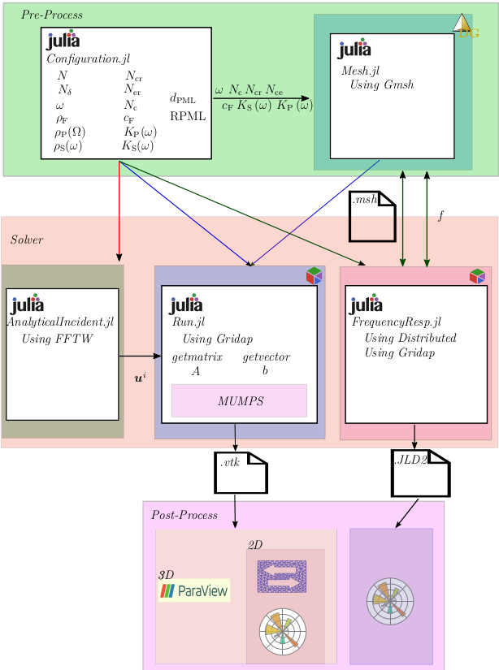

<!-- <!--  -->


<!--  -->

# Vibroacoustic Quantification of a Coastal Seabed

[](http://hdl.handle.net/2183/38133)

The repository contains a solver that computes the acoustic response of various objects buried in a seabed domain, along with benchmark cases featuring known analytical solutions that verify the solver's implementation.


<p align="center">
  <a href="resources/Beamer_M2i.pdf">  </a>
  <i> <small> (Click image to view presentation) </small> </i>
</p>

<hr style="border:1px"> 

## Description
The solver and all the benchmarks cases follows the following framework:

<p align="center">
  
</p>
<p align="center">
  <i>Software tools workflow</i>
</p>

- During the Pre-Process stage, the user needs to configure the `Configuration.jl` file. This file contains all the parameters required to define the problem to be solved. Once the parameters are set, the `Configuration.jl` file is imported by `Mesh.jl`, which generates the necessary mesh for the simulation.

- During the solver stage, the generated `mesh.msh` and the `Configuration.jl` are imported into `Run.jl`file, which computes the solution to the problem using [Gridap](https://github.com/gridap/Gridap.jl)  a Julia Finite Element library. Additionally, the user can compute the frequency response of the problem of interest in parallel by leveraging [Gridap](https://github.com/gridap/Gridap.jl) alongside Distributed, a native Julia library for parallel computations.

- During the Post-Process stage, the simulation results are exported to `.vtu` files, which are compatible with ParaView software for visualizing the results. For more professional plotting in 2D cases, the `.vtu` can be exported tu NumPy objects by using [Meshio](https://github.com/nschloe/meshio) and then plotted using Matplotlib.


<hr style="border:1px">

## Requirements and Setup
### Prerequisites
Have a stable version of Julia. All this code has been run on a personal LAPTOP.

### Installation

```bash
git clone https://github.com/pablorubial/SeabedFEM.git
```


## Acknoledgments

<p align="left"">

  
  
</p>

<hr style="border:1px"> 