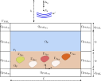
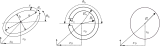
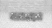
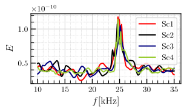
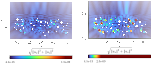

# AquaAcoustics
This code solves the backscattering problem for an arbitrary number of rigid objects with boundary $\Gamma_{\mathrm{S}}$ buried in the seabed domain ($\Omega_\mathrm{P}$) that could take an arbitrary shape. The translation of the solution technique is also applied, this means split the the total acoustic field in an incident known field and a scattering one ($\boldsymbol{u} = \boldsymbol{u}^i + \boldsymbol{u}^s$). The incident field generated by the sonar is modelled as an end-fire array of $N_\delta$ Dirac's delta separated a distance $\Delta y$. The incident field is computed through a Fourier Mode Decomposition (see `AnalyticalIncident.jl`). The computational domain is shown in the following figure:

<p align="center">
  
</p>

whose mathematical equations can written as follows:

$$
\left\\{
\begin{array}{l}
-\omega^2 \rho(\omega)J \boldsymbol{U}^s - K(\omega)\mathrm{div}\left(JH^{-T}\left(H^{-1}:\nabla\boldsymbol{U}^s\right)\right) = \boldsymbol{0} \qquad  &\text{in } \Omega_{\mathrm{F}} \cup \Omega_{\mathrm{P}}\cup \Omega_{\mathrm{PML}},\\ 
\rho_{\mathrm{F}} c_{\mathrm{F}}^2 \mathrm{div}\boldsymbol{U}^s\_{\mathrm{F}} = K_{\mathrm{P}}(\omega)\mathrm{div}\boldsymbol{U}^s\_{\mathrm{P}}  \qquad  &\text{on } \Gamma_\mathrm{I}, \\
 \boldsymbol{U}^s\_{\mathrm{F}} \cdot \boldsymbol{n} = \boldsymbol{U}^s\_{\mathrm{P}} \cdot \boldsymbol{n} \qquad  &\text{on } \Gamma_\mathrm{I}, \\
 \boldsymbol{U}^s\_{\mathrm{P}} \cdot \boldsymbol{n} = \boldsymbol{U}^i \cdot \boldsymbol{n} \qquad  &\text{on } \Gamma_{\mathrm{S}\_\mathrm{P}}, \\
 \boldsymbol{U}^s\cdot \boldsymbol{n} = 0 \qquad  &\text{on } \Gamma_\mathrm{PML}.
\end{array}
\right. 
$$

The $\Omega_{\mathrm{PML}}$ domain is divided at the same time in:

* $\Omega_{\mathrm{PML}_\mathrm{F1}}$: that corresponds to the fluid domain PML. In this domain, horizontal absorptions are desired.
* $\Omega_{\mathrm{PML}_\mathrm{F2}}$: that corresponds to the fluid domain PML. In this domain, vertical absorptions are desired.
* $\Omega_{\mathrm{PML}_\mathrm{F3}}$ that corresponds to the corners generated by the intersection between the top and fluid. In this domain, horizontal and vertical absorptions are desired.
The computational domain is shown in the following figure:
* $\Omega_{\mathrm{PML}_\mathrm{P1}}$: that corresponds to the porous domain PML. In this domain, horizontal absorptions are desired.
* $\Omega_{\mathrm{PML}_\mathrm{P2}}$ that corresponds to the bottom domain PML. In this domain, vertical  absorptions are desired.
* $\Omega_{\mathrm{PML}_\mathrm{P3}}$ that corresponds to the corners generated by the intersection between the bottom and porous. In this domain, horizontal and vertical absorptions are desired.


In this code, three shapes of rigid objects that are fully parametrised can be choosen:

<p align="center">
  
</p>

that can lead to finite element meshes like the following one:

<p align="center">
  
</p>

The variational formulation of this problem can be written as follows:

$$
\begin{split}
    \underbrace{\omega^2\int_{\Omega_{\mathrm{F}} \cup \Omega_{\mathrm{P}} \cup\Omega_{\mathrm{PML}}}{\rho J^{-1}\left(H\boldsymbol{U}\right)\cdot\left(H\boldsymbol{v}\right) \mathrm{d}\Omega}}\_{\text{mass term}} -
    \underbrace{\int_{\Omega_{\mathrm{F}} \cup \Omega_{\mathrm{P}}\cup \Omega_{\mathrm{PML}}}{K(\omega)J^{-1}\mathrm{div}\boldsymbol{U}\mathrm{div}\boldsymbol{v} \mathrm{d}\Omega}}\_{\text{stiffness term}} = 0 \qquad  \forall{\boldsymbol{v}}\in V,
\end{split}
$$

where the matrix $H$ and $J=\mathrm{det}H$ take into account the change of coordinates introduced in the PML domain. The matrix $H$ is defined for every domain as follows:

$$
H = \begin{cases}
    \begin{bmatrix}
            \gamma_{1_{\mathrm{F}}} & 0 \\
            0 & 1 \\
    \end{bmatrix}\quad \text{in} \quad \Omega_{\mathrm{PML}\_{\mathrm{F1}}},\\
    \begin{bmatrix}
            1& 0 \\
            0 & \gamma_{2_{\mathrm{F}}} \\
    \end{bmatrix}\quad \text{in} \quad \Omega_{\mathrm{PML}\_{\mathrm{F2}}},\\
    \begin{bmatrix}
            \gamma_{1_{\mathrm{F}}} & 0 \\
            0 & \gamma_{2_{\mathrm{F}}} \\
    \end{bmatrix}\quad \text{in} \quad \Omega_{\mathrm{PML}\_{\mathrm{F3}}},\\
    \begin{bmatrix}
            \gamma_{1_{\mathrm{P}}} & 0 \\
            0 & 1 \\
    \end{bmatrix}\quad \text{in} \quad \Omega_{\mathrm{PML}\_{\mathrm{P1}}},\\
    \begin{bmatrix}
            1 & 0 \\
            0 & \gamma_{2_{\mathrm{P}}} \\
    \end{bmatrix}\quad \text{in} \quad \Omega_{\mathrm{PML}\_{\mathrm{P2}}},\\
    \begin{bmatrix}
            \gamma_{1_{\mathrm{P}}} & 0 \\
            0 & \gamma_{2_{\mathrm{P}}} \\
    \end{bmatrix}\quad \text{in} \quad \Omega_{\mathrm{PML}\_{\mathrm{P3}}},\\
    \begin{bmatrix}
            1 & 0 \\
            0 & 1 \\
    \end{bmatrix}\quad \text{in} \quad \Omega_{\mathrm{F}} \cup \Omega_{\mathrm{P}}. 
    \end{cases}
$$

The results that could be obtained with this code are:

* The frequency response of the case of study generated, where the target variable in the computation is the $L^2$ norm computed in all the fluid domain. That for the mesh example provided here, leads to the following response:

<p align="center">
  
</p>

* The energy fields associated to differents frequencies of the frequency response, in the following figure, it corresponds to the energy field od the scenario 1 (Sc1) associated with the valley previous to the resonance peak and to the resonance peak frequencies.

<p align="center">
  
</p>


## Requirements and Setup
### Prerequisites
Have a stable version of Julia. All this code has been run on a personal LAPTOP.

### Installation

```bash
git clone https://github.com/pablorubial/SeabedFEM.git
cd AquaAcoustics
```
```julia
using Pkg
Pkg.activate(".")
Pkg.instantiate()
```
### Usage 
First of all, the `Configuration.jl` should be used to all the parameters of the simulation.

Starting with the dimensions of the domain:

- $L$: length of the domain [m]
- $t_{\mathrm{P}}$: heigth of the porous domain [m]
- $t_{\mathrm{F}}$: heigth of the fluid domain [m]
- $h$: heigth of the column water above $t_{\mathrm{F}}$. Is only used to establish the position of the transducer, but the domain is truncated and not contains this area of the fluid domain [m]
- $d_{\mathrm{PML}}$: thickness of the PML [m]

Transducer position should be parametrised. Since an end-fire array can be established, user must give the following parameters:
- $x_{\beta}$ : horizontal coordinate of the sonar transducer [m] 
- $yᵦ$ : vertical coordinate of the sonar transducer [m]
- $N_\mathrm{s}$ : number of points to simulate the sonar transducer seen as Dirac's deltas [-]
- $L_\mathrm{s}$ : length of the segment that represents the sonar transducer [m]
- $\Delta y$ : separation between the points of the sonar discretization points [m]
- $A_\mathrm{s}$ : amplitude of the sonar transducer [Pa]
- $f$: frequency of the transducer [Hz]
 

Media properties such as the densities and sound velocity of the fluid and porous mediums:
- $\rho_{\mathrm{F}}(\omega)$
- $c_{\mathrm{F}}(\omega)$
- $\rho_{\mathrm{P}}(\omega)$
- $c_{\mathrm{P}}(\omega)$

Scattering objects should be defined. At this point, there is a module inside `MarineFormsDict.jl` that contains Julia structs to define three types of objects: circles, ellipses and clamps that could be porous, generating a new medium ($\Omega_{\mathrm{S}}$) where the properties of it should be defined, or rigid, where the object reflect all the waves. At this point all the objects should be defined as rigid. The user can choose the number of objects of each type that wants to appear in the porous domain with the precaution of not taking too many of them so that all the objects do not enter the domain and collide with each other. In this case, the algorithm will get blocked, since it generates a new animal every time that a collision is detected to repositioning the previous one.

The parameters that defined the circles are:
- $N_\mathrm{{rigid_{circles}}}$ : number of rigid circles in the porous domain [-]
- $N_\mathrm{{porous_{circles}}}$: number of porous circles in the porous domain [-]    
- $r_0$: interior radius of the circle [m]
- $\sigma_r$ : standard deviation of the interior radius of the circle [m]
- $\mathrm{tol}_\mathrm{circles}$ : tolerance for the clamps to avoid collisions with the boundaries of the physical domain

At the same time, the parameters that define the clamps are the following ones:

- $N_\mathrm{{rigid_{clamps}}}$ : number of rigid clamps in the porous domain [-]
- $N_\mathrm{{porous_{clamps}}}$: number of porous clamps in the porous domain [-]
- $r_{0_i}$ : interior radius of the clamp [m]
- $\sigma_{r_i}$ : standard deviation of the interior radius of the clamp [m]
- $r_{0_e}$ : exterior radius of the clamp [m] 
- $\sigma_{r_e}$ : standard deviation of the interior radius of the clamp [m]
- $\theta_{o_\mathrm{min}}$ : minimum opening angle of the clamp [rad]
- $\theta_{o_\mathrm{max}}$ : maximum opening angle of the clamp [rad]
- $\theta_{b_\mathrm{min}}$ : minimum bisector angle of the clamp [rad]
- $\theta_{b_\mathrm{max}}$ : maximum bisector angle of the clamp [rad]
- $\mathrm{tol}_\mathrm{clamps}$ : tolerance for the circles to avoid collisions with the boundaries of the physical domain

Finally the parameters to define the ellipses can be defined as follows:

- $N_\mathrm{{rigid_{ellipses}}}$ : number of rigid ellipses in the porous domain [-]
- $a_0$ : major semi-axis of the ellipse [m]
- $σ_a$ : standard deviation of the major semi-axis of the ellipse [m]
- $b_0$ : minor semi-axis of the ellipse [m]
- $σ_b$ : standard deviation of the minor semi-axis of the ellipse [m]
- $e_{\mathrm{min}}$: minimum espesor of the ellipse [m]
- $e_{\mathrm{max}}$: maximum espesor of the ellipse [m]
- $\theta_{\mathrm{el}_\mathrm{min}}$ : minimum angle of the ellipse [rad]
- $\theta_{\mathrm{el}_\mathrm{max}}$ : maximum angle of the ellipse [rad]
- $\alpha_{\mathrm{min}}$ : minimum angle of rotation of the ellipse [rad]
- $\alpha_{\mathrm{max}}$ : maximum angle of rotation the ellipse [rad]
- $\mathrm{tol}_\mathrm{ellipse}$ : tolerance for the ellipses to avoid collisions with the boundaries of the physical domain

    


Once the parameters of the simulation are established, one should call the meshing script, which includes the `Configuration.jl`, and construct the mesh:
```julia
include("src/Mesh.jl")
```

If differents scenarios with differents positions and orientation want be generate, the `ScenariosGenerator.jl` file should be used, where the user define the number of scenarios and the name of each one, then they are saved in the folder specified by the user.

Once the mesh for each of the scenarios, the `ParallelRun.jl` script should be called. This script basically computes the frequency response of each generated scenario using parallel computing techniques. Basically, it splits the frequency range equally between the number of cores selected by the user, and split the workload equally between them. The code basically computes the energy of the backscattering signal inside the fluid domain, and finally is saved in a `.jld2` file together with the frequency range, and then, the frequency response can be plotted.


### Authors
This work has been carried out by Andres Prieto Aneiros (andres.prieto@udc.es) and Pablo Rubial Yáñez (p.rubialy@udc.es) during the work developed in the [NumSeaHy](https://dm.udc.es/m2nica/en/node/157) project.

### License
 <p xmlns:cc="http://creativecommons.org/ns#" >This work is licensed under <a href="http://creativecommons.org/licenses/by/4.0/?ref=chooser-v1" target="_blank" rel="license noopener noreferrer" style="display:inline-block;">CC BY 4.0</a></p> 