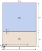
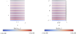

# Benchmark 1

This benchmark corresponds to a two-dimensional problem propagation between two domains coupled by an interface. This is not a problem in an open domain (like the nature of the real one), but it serves as an initial test to verify the implementation of the finite element discretization in a simple scenario.. The computational domain is shown in the following figure:

<p align="center">
  
</p>


whose mathematical equations are the following:

$$
\left\\{
\begin{array}{l}
-\omega^2 \rho(\omega) \boldsymbol{u} - \mathrm{grad}\left(K(\omega)\mathrm{div}\boldsymbol{u}\right) = \boldsymbol{0} \qquad  &\text{in } \Omega_{\mathrm{F}} \cup \Omega_{\mathrm{P}}, \\
\boldsymbol{u}\cdot \boldsymbol{n}  = 0 \qquad  &\text{on } \partial(\Omega_{\mathrm{F}} \cup \Omega_{\mathrm{P}}) \backslash \Gamma_\mathrm{T}, \\
-\rho_{\mathrm{F}} c_{\mathrm{F}}^2 \mathrm{div} \boldsymbol{u} = P_0 \qquad  &\text{on } \Gamma_\mathrm{T}, \\
\rho_{\mathrm{F}} c_{\mathrm{F}}^2 \mathrm{div}\boldsymbol{u}\_{\mathrm{F}} = K_{\mathrm{P}}(\omega)\mathrm{div}\boldsymbol{u}\_{\mathrm{P}}  \qquad  &\text{on } \Gamma_\mathrm{I}, \\
 \boldsymbol{u}\_{\mathrm{F}} \cdot \boldsymbol{n} = \boldsymbol{u}\_{\mathrm{P}} \cdot \boldsymbol{n} \qquad  &\text{on } \Gamma_\mathrm{I},
\end{array}
\right. 
$$

where the $\boldsymbol{u}$, $K(\omega)$ and $\rho(\omega)$ ia defined for each domain as 

$$
\boldsymbol{u} = \begin{cases}
    \boldsymbol{u}\_{\mathrm{F}} \quad \text{in} \quad \Omega_{\mathrm{F}},\\
    \boldsymbol{u}\_{\mathrm{P}} \quad \text{in} \quad \Omega_{\mathrm{P}}
\end{cases}
$$

,

$$
\rho(\omega) = \begin{cases}
    \rho\_{\mathrm{F}} \quad \text{in} \quad \Omega_{\mathrm{F}},\\
    \rho\_{\mathrm{P}}(\omega) \quad \text{in} \quad \Omega_{\mathrm{P}}
\end{cases}
$$

and 

$$
K(\omega) = \begin{cases}
    \rho\_{\mathrm{F}}c\_{\mathrm{F}}^2 \quad \text{in} \quad \Omega_{\mathrm{F}},\\
    K\_{\mathrm{P}}(\omega) \quad \text{in} \quad \Omega_{\mathrm{P}}
\end{cases}
$$

The variational formulation of this partial differential equation can be written as follows:

$$
  \underbrace{\omega^2\int_{\Omega_{\mathrm{F}}\cup \Omega_{\mathrm{P}}}{\rho(\omega)(\boldsymbol{u}\cdot\boldsymbol{v})\ dV}}\_{\text{mass term}} -
    \underbrace{\int_{\Omega_{\mathrm{F}}\cup \Omega_{\mathrm{P}}}{K(\omega)\ \mathrm{div}\boldsymbol{u}\ \mathrm{div}\ \boldsymbol{v}\ dV}}\_{\text{stiffness term}} = \underbrace{\int_{\Gamma_{\mathrm{T}}}{P_0\left(\boldsymbol{v}\cdot\boldsymbol{n}\right)\ dS}}_{\text{source term}}  \qquad  \forall{\boldsymbol{v}}\in V.
$$ 

The results obtained, among other things, compare the solution obtained by the solver with the analytical solution of the problem showing that both match perfectly:


<p align="center">
  
</p>


## Requirements and Setup
### Prerequisites
Have a stable version of Julia. All this code has been run on a personal LAPTOP.

### Installation

```bash
git clone https://github.com/pablorubial/SeabedFEM.git
cd benchmark1
julia
```
```julia
using Pkg
Pkg.activate(".")
Pkg.instantiate()
```
### Usage
This directory has the following sub-directories to run a case:

* `data` where the mesh files are saved. `.msh` and `.json` files live in this directory. The first ones save the mesh generated using Gmsh. The last ones convert these files into the format that Gridap uses to run the simulations.
* `data_freq` where the meshes generated for the frequency analysis are stored. If a long sweeo of frequencies is run a lot of `.msh` and `.json` files will be generated on this folder. When analysis is done, is recommendable to run `AllClean_Freq` which is a bash file that cleans this folder.
* `images` where the domain image and some other characteristic images are saved.
* `results`: In this folder, all the files that one wants to visualize are saved. The mesh with the tags can be visualized with the `.vtu` files generated during the mesh creation. It is recommended to open the `mesh_file_1.vtu` with ParaView to visualize the mesh with the corresponding tags. The resultant fields of the harmonic regime simulation are saved in `results.vtu`, where one can check the results.
* `results_freq` where the results of the frenquency analysis are saved. The $L_2$ norm of the solution together with its correspondency frequency is saved on the file `freq.jld2` file. Also the `.vtu` solution fields for the peaks of the frequency analysis is saved on this folder with the names `peak_n.vtu`.
* `src` where the main source code of the program is written
    
    * `Analytical.jl` solves analytically the problem stated on this repository. This will let us verifiy that the numerical implementation reachs $O(h^2)$, which is the order obtained from numerical analysis.
    * `Configuration.jl` configure the parameters to run a case. A more elaborate explanation of this file is given below.
    * `FrequencyResponse.jl` makes a frequency analysis of the question problem. Inside this script is a function called 
        ```julia
        Run(f, save_vtk::bool, save_jld::bool)
        ```
        where f is the range of frequencies that one wants to analyze, save_vtk stablish if the results should be saved in vtu format and save_jld2 stablish if the results of the L2 norm of the solution and the ranfe of frequencies should be saved on a jld2 file to then make a plot of the frequency response.
    * `FunMesh.jl` with `MeshGenerator(c_F, c_P, f, L, H, d, name)` inside creates a mesh with 15 point per wavelength and takes as input the physical parameters of the simulation. This function is used by `FrequencyResponse.jl` to generate a mesh for each frequency.
    * `Main.jl` runs a general setup of the problem for the configuration parameters that are on the `Configuration.jl` file and save the results in `.vtu` format.
    * `Mesh.jl` scrip that generates the mesh for the configuration parameters. The mesh generated will be used by the `Main.jl` file to run a case.
    * `ConvTest.jl` makes a convergence test taking the path os the meshes generated with `Refine.jl` file and calling to `Run.jl` file. This return the order of convergence and at the same time generates a plot of the percentage relative error ($1e2\frac{\boldsymbol{u}-\boldsymbol{u_h}}{\boldsymbol{u}}$) vs mesh size ($h$).
    *  `PostProcess:jl` This script contains a plot function `PlotFrequencyResp()` where if the path of `freq.jld2` is given, a pdf plot of the frequency response is generated in the `results_freq` directory.
    * `Properties.jl` is where the functions field to establish the properties of each physical domain are coded.
    * `Refine.jl` This script uses Gmsh to refine one mesh into another one finer, keeping the original nodes. This kind of mesh is necessary if a convergence test is needed.
    * `Run.jl`: function that runs the main problem for a mesh given as input argument. This function is used by the `ConvTest.jl` file to run the convergence test.
    * `SaveVTK_Peaks.jl` takes the `.jld2` file of the frequency response and identifies the n first peaks that corresponds to resonances frequencies. After that runs and save in `.vtu` file the fields for the first no resonance frequencies.
       

First of all, the `Configuration.jl` should be used to establish the domains dimensions:
- $L$: Length of the domain.
- $t_{\mathrm{P}}$: Heigth of the porous domain.
- $t_{\mathrm{F}}$: Heigth of the fluid domain.

media properties such as the densities and sound velocity of the fluid and porous mediums:
- $\rho_{\mathrm{F}}$,
- $c_{\mathrm{F}}$,
- $\rho_{\mathrm{P}}$,
- $c_{\mathrm{P}}$.

frequency and transducer pressure value:
- $f$,
- $P_0$. 

Once the parameters of the simulation are established, one should call the meshing script, which includes the `Configuration.jl`, and construct the mesh:
```julia
include("src/Mesh.jl")
```

Once the Mesh is generated, the `Run.jl` script should be used to run the case. This script takes from the `data` directory the Mesh generated in the previous step.
```julia
include("src/Run.jl")
```

To run a frequency analysis between 10kHz and 20kHz with a step size of 0.5kHz and post-process the results:
```julia
include("src/FrequencyResponse.jl")
Run(10e3:0.5e3:20e3, false, true)
```
By this way, the frequency response is saved on `results_freq/freq.jld2` and to plot the response:
```julia
include("src/PostProcess.jl")
PlotFrequencyResp("results_freq/freq.jld2")
```
if the fields corresponding to the resonance frequencies want to be seen, once the frequency response is saved on the `.jld2` file run:
```julia
include("src/SaveVTK_Peaks.jl")
```
and the results will be saved on `results_freq` folder as follows:
* `peak1.vtu`
* `peak2.vtu`
* `peakn.vtu`
### Authors
This work has been carried out by Andres Prieto Aneiros (andres.prieto@udc.es) and Pablo Rubial Yáñez (p.rubialy@udc.es) during the work developed in the [NumSeaHy](https://dm.udc.es/m2nica/en/node/157) project.

### License
 <p xmlns:cc="http://creativecommons.org/ns#" >This work is licensed under <a href="http://creativecommons.org/licenses/by/4.0/?ref=chooser-v1" target="_blank" rel="license noopener noreferrer" style="display:inline-block;">CC BY 4.0</a></p> 
