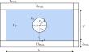
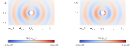

# Benchmark 2

This benchmark is a valuable tool for verifying the implementation of PML and consists in simulate the emitted field of a sphere situated in an open domain. This benchmark ensures that the combination of the finite element discretization and the PML accurately simulates open boundary conditions by effectively absorbing outgoing waves and minimizing reflections. The computational domain of this benchmark is shown in the following figure:

<p align="center">
  
</p>

whose mathematical equations are the following:


$$
\left\\{
\begin{array}{l}
-\omega^2 \rho_{\mathrm{F}}J \boldsymbol{U} - \rho_{\mathrm{F}}c_{\mathrm{F}}^2\mathrm{div}\left(JH^{-T}\left(H^{-1}:\nabla\boldsymbol{U}\right)\right) = \boldsymbol{0} \qquad  &\text{in } \Omega_{\mathrm{F}} \cup \Omega_{\mathrm{PML}},\\ 
-\rho_{\mathrm{F}} c_{\mathrm{F}}^2 \mathrm{div} \boldsymbol{U}\_{\mathrm{F}} = P_0 \qquad  &\text{on } \Gamma_\mathrm{S}, \\
\boldsymbol{U}\cdot \boldsymbol{n} = 0 \qquad  &\text{on } \Gamma_\mathrm{PML}.
\end{array}
\right. 
$$

The variational formulation of this problem can be written as follows:

$$
\begin{split}
    \underbrace{\omega^2\int_{\Omega_{\mathrm{F}}\cup\Omega_{\mathrm{PML}}}{\rho_\mathrm{F}J^{-1}\left(H\boldsymbol{U}\right)\cdot\left(H\boldsymbol{v}\right) \mathrm{d}\Omega}}\_{\text{mass term}} -
    \underbrace{\int_{\Omega_{\mathrm{F}}\cup \Omega_{\mathrm{PML}}}{\rho_\mathrm{F}c_\mathrm{F}^2J^{-1}\mathrm{div}\boldsymbol{U}\mathrm{div}\boldsymbol{v} \mathrm{d}\Omega}}\_{\text{stiffness term}} = \\
    \underbrace{\int_{\Gamma_{\mathrm{S}}}{P_0\left(\boldsymbol{v}\cdot\boldsymbol{n}\right)\ \mathrm{d}\Gamma_\mathrm{S}}}\_{\text{source term}} \qquad  \forall{\boldsymbol{v}}\in V,
\end{split}
$$

where the matrix $H$ and $J=\mathrm{det}H$ take into account the change of coordinates introduced in the PML domain. The matrix $H$ is defined for every domain as follows:

$$
H = \begin{cases}
    \begin{bmatrix}
            \gamma_{1_{\mathrm{F}}} & 0 \\
            0 & \gamma_{2_{\mathrm{F}}} \\
    \end{bmatrix}\quad \text{in} \quad \Omega_{\mathrm{PML}},\\
    \begin{bmatrix}
            1 & 0 \\
            0 & 1 \\
    \end{bmatrix}\quad \text{in} \quad \Omega_{\mathrm{F}} . 
    \end{cases}
$$

Notice that in the fluid domain $\Omega_{\mathrm{F}}$ where the $H$ matrix is equal to the identity, the variational formulation of Benchmark 1 is recovered:

$$
  \underbrace{\omega^2\int_{\Omega_{\mathrm{F}}}{\rho_\mathrm{F}\boldsymbol{u}\cdot\boldsymbol{v}\ dV}}\_{\text{mass term}} -
    \underbrace{\int_{\Omega_{\mathrm{F}}}{\rho_\mathrm{F}c_\mathrm{F}^2 \mathrm{div}\boldsymbol{u} \mathrm{div}\ \boldsymbol{v}\ dV}}\_{\text{stiffness term}} = \underbrace{\int_{\Gamma_{\mathrm{S}}}{P_0\left(\boldsymbol{v}\cdot\boldsymbol{n}\right)\ dS}}_{\text{source term}}  \qquad  \forall{\boldsymbol{v}}\in V.
$$ 

The results obtained, among other things, compare the numerical solution obtained by the solver using the novel PML formulation with the analytical solution of the problem showing that both match perfectly:


<p align="center">
  
</p>


## Requirements and Setup
### Prerequisites
Have a stable version of Julia. All this code has been run on a personal LAPTOP.

### Installation

```bash
git clone https://github.com/pablorubial/NumSeaHy.git
cd benchmark2
```

```julia
using Pkg
Pkg.activate(".")
Pkg.instantiate()
```
### Usage
This directory has the following sub-directories to run a case:

* `data` where the mesh files are saved. `.msh` files live in this directory. The mesh is generated using Gmsh and then Gridap uses it to run the simulations.
* `images` where the domain image and some other characteristic images are saved.
* `results`: In this folder, all the files that one wants to visualize are saved. The mesh with the tags can be visualized with the `.vtu` files generated during the mesh creation. It is recommended to open the `pml_mesh_1.vtu` with ParaView to visualize the mesh with the corresponding tags. The resultant fields of the simulation are saved in `results.vtu`, where one can check the results.
* `src` where the main source code of the program is written
    
    * `ExactSolution.jl` solves analytically the problem stated on this repository. The solution is not valid for the $\Omega_{\mathrm{PML}}$ subdomain but is expected to obtain similar results to the PML implementation in the $\Omega_{\mathrm{F}}$ and $\Omega_{\mathrm{P}}$
    * `Configuration.jl` configure the parameters to run a case. A more elaborate explanation of this file is given below.
    * `Mesh.jl` This file generates the mesh using Gmsh and saves the results into `data` and `results` folders.
    *  `MeshQuad.jl` This file generates a quadrangular mesh using Gmsh and saves the results into `data` and `results` folders. However, this mesh cannot be used since Gridap haven not developed yet the posssibility of use R-T finite elements together with no strctured meshes.
    * `Refine.jl` This script uses Gmsh to refine one mesh into another one finer, keeping the original nodes. This kind of mesh is necessary if a convergence test is needed.
    * `RunConvTest.jl` This script computes the error between the numerical and the analytical solution for different meshes and returns the $L^2$ relative error.
    * `ConvTest:jl` This script automates the process of perform a convergence test by using the function inside. `RunConvTest.jl` and plots the order of convergence triangle saving the resulting image in the `results/` folder.
    *  `Run.jl`: solves the benchmark by using a novel PML formulation that ensures that the numerical results match exactly with the analytical solution of the problem and allows to recover the order $O(h^2)$ of the numerical method.
    *  `RunTraditional.jl`: solves the benchmark by using a traditional PML formulation that showing that traditional PML formulations doesn't work to solve this kind of problem formulate in displacements and using R-T finite elements.

First of all, the `Configuration.jl` should be used to establish the domains dimensions:
- $L$: Length of the domain
- $t_{\mathrm{P}}$: Heigth of the porous domain
- $t_{\mathrm{F}}$: Heigth of the fluid domain
- $t$: Length of the sonar
- $d_{\mathrm{PML}}$: Thickness of the PML

Media properties such as the densities and sound velocity of the fluid and porous mediums:
- $\rho_{\mathrm{F}}$
- $c_{\mathrm{F}}$
- $\rho_{\mathrm{P}}$
- $c_{\mathrm{P}},$

Frequency and transducer pressure value:
- $f$
- $P_0$. 

Once the parameters of the simulation are established, one should call the meshing script, which includes the `Configuration.jl`, and construct the mesh:
```julia
include("src/Mesh.jl")
```

Once the Mesh is generated, the `Run.jl` script should be used to run the case. This script takes from the `data` directory the Mesh generated in the previous step.
```julia
include("src/Run.jl")
```


### Authors
This work has been carried out by Andres Prieto Aneiros (andres.prieto@udc.es) and Pablo Rubial Yáñez (p.rubialy@udc.es) during the work developed in the [NumSeaHy](https://dm.udc.es/m2nica/en/node/157) project.

### License
 <p xmlns:cc="http://creativecommons.org/ns#" >This work is licensed under <a href="http://creativecommons.org/licenses/by/4.0/?ref=chooser-v1" target="_blank" rel="license noopener noreferrer" style="display:inline-block;">CC BY 4.0</a></p> 
