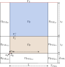
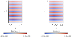

# Benchmark 3

This benchmark extends the scope of Benchmark 1 by considering an open domain scenario. To accommodate this, a solution inside the PML layer that avoid reflections coming back into the domain is calculated. The computation of the solution inside the PML allows to make a convergence test avoiding the errors introduced by the PML and recover the order of convergence of the numerical method. The computational domain is shown in the following figure:

<p align="center">
  
</p>

whose mathematical equations are the following:

$$
\left\\{
\begin{array}{l}
-\omega^2 \rho(\omega)J \boldsymbol{U} - K(\omega)\mathrm{div}\left(JH^{-T}\left(H^{-1}:\nabla\boldsymbol{U}\right)\right) = \boldsymbol{0} \qquad  &\text{in } \Omega_{\mathrm{F}} \cup \Omega_{\mathrm{P}}\cup \Omega_{\mathrm{PML}},\\ 
-\rho_{\mathrm{F}} c_{\mathrm{F}}^2 \mathrm{div} \boldsymbol{U} = P_0 \qquad  &\text{on } \Gamma_\mathrm{T}, \\
\rho_{\mathrm{F}} c_{\mathrm{F}}^2 \mathrm{div}\boldsymbol{U}\_{\mathrm{F}} = K_{\mathrm{P}}(\omega)\mathrm{div}\boldsymbol{U}\_{\mathrm{P}}  \qquad  &\text{on } \Gamma_\mathrm{I}, \\
 \boldsymbol{U}\_{\mathrm{F}} \cdot \boldsymbol{n} = \boldsymbol{U}\_{\mathrm{P}} \cdot \boldsymbol{n} \qquad  &\text{on } \Gamma_\mathrm{I}, \\
 \boldsymbol{U}\cdot \boldsymbol{n} = 0 \qquad  &\text{on } \Gamma_\mathrm{PML},
\end{array}
\right. 
$$

where the $\Omega_{\mathrm{PML}}$ domain is divided at the same time in:
* $\Omega_{\mathrm{PML}_F}$: that corresponds to the fluid domain PML. In this domain, horizontal absorptions are desired.
* $\Omega_{\mathrm{PML}_{P1}}$: that corresponds to the porous domain PML. In this domain, horizontal absorptions are desired.
* $\Omega_{\mathrm{PML}_{P2}}$ that corresponds to the bottom domain PML. In this domain, vertical  absorptions are desired.
* $\Omega_{\mathrm{PML}_{P3}}$ that corresponds to the corners generated by the intersection between the bottom and porous. In this domain, horizontal and vertical absorptions are desired.

The variational formulation of this problem can be written as follows:

$$
\begin{split}
    \underbrace{\omega^2\int_{\Omega_{\mathrm{F}} \cup \Omega_{\mathrm{P}} \cup\Omega_{\mathrm{PML}}}{\rho J^{-1}\left(H\boldsymbol{U}\right)\cdot\left(H\boldsymbol{v}\right) \mathrm{d}\Omega}}\_{\text{mass term}} -
    \underbrace{\int_{\Omega_{\mathrm{F}} \cup \Omega_{\mathrm{P}}\cup \Omega_{\mathrm{PML}}}{K(\omega)J^{-1}\mathrm{div}\boldsymbol{U}\mathrm{div}\boldsymbol{v} \mathrm{d}\Omega}}\_{\text{stiffness term}} = \\
    \underbrace{\int_{\Gamma_{\mathrm{T}}}{P_0\left(\boldsymbol{v}\cdot\boldsymbol{n}\right)\ \mathrm{d}\Gamma_\mathrm{T}}}\_{\text{source term}} \qquad  \forall{\boldsymbol{v}}\in V,
\end{split}
$$


where the matrix $H$ and $J=\mathrm{det}H$ take into account the change of coordinates introduced in the PML domain. The matrix $H$ is defined for every domain as follows:

$$
H = \begin{cases}
    \begin{bmatrix}
            \gamma_{1_{\mathrm{F}}} & 0 \\
            0 & 1 \\
    \end{bmatrix}\quad \text{in} \quad \Omega_{\mathrm{PML}\_{\mathrm{F}}},\\
    \begin{bmatrix}
            \gamma_{1_{\mathrm{P}}} & 0 \\
            0 & 1 \\
    \end{bmatrix}\quad \text{in} \quad \Omega_{\mathrm{PML}\_{\mathrm{P1}}},\\
    \begin{bmatrix}
            1 & 0 \\
            0 & \gamma_{2_{\mathrm{P}}} \\
    \end{bmatrix}\quad \text{in} \quad \Omega_{\mathrm{PML}\_{\mathrm{P2}}},\\
    \begin{bmatrix}
            \gamma_{1_{\mathrm{P}}} & 0 \\
            0 & \gamma_{2_{\mathrm{P}}} \\
    \end{bmatrix}\quad \text{in} \quad \Omega_{\mathrm{PML}\_{\mathrm{P3}}},\\
    \begin{bmatrix}
            1 & 0 \\
            0 & 1 \\
    \end{bmatrix}\quad \text{in} \quad \Omega_{\mathrm{F}} \cup \Omega_{\mathrm{P}}. 
    \end{cases}
$$

Notice that in the fluid and porous domains $\Omega_{\mathrm{F}}$ and $\Omega_{\mathrm{P}}$ where the $H$ matrix is equal to the identity, the variational formulation of the problem A is recovered:

$$
  \underbrace{\omega^2\int_{\Omega_{\mathrm{F}}\cup \Omega_{\mathrm{P}}}{\rho(\omega)\boldsymbol{U}\cdot\boldsymbol{v}\ dV}}\_{\text{mass term}} -
    \underbrace{\int_{\Omega_{\mathrm{F}}\cup \Omega_{\mathrm{P}}}{K(\omega)\, \mathrm{div}\boldsymbol{U} \ \mathrm{div}\ \boldsymbol{v}\ dV}}\_{\text{stiffness term}} = \underbrace{\int_{\Gamma_{\mathrm{T}}}{P_0\left(\boldsymbol{v}\cdot\boldsymbol{n}\right)\ dS}}_{\text{source term}}  \qquad  \forall{\boldsymbol{v}}\in V.
$$ 

The results obtained, among other things, compare the numerical solution obtained by the solver using the novel PML formulation with the analytical solution of the problem showing that both match perfectly:

<p align="center">
  
</p>


## Requirements and Setup
### Prerequisites
Have a stable version of Julia. All this code has been run on a personal LAPTOP.

### Installation

```bash
git clone https://github.com/pablorubial/NumSeaHy.git
cd benchmark3
```

```julia
using Pkg
Pkg.activate(".")
Pkg.instantiate()
```

### Usage
This directory has the following sub-directories to run a case:

* `data` where the mesh files are saved. `.msh` and `.json` files live in this directory. The first ones save the mesh generated using Gmsh. The last ones convert these files into the format that Gridap uses to run the simulations.
* `images` where the domain image and some other characteristic images are saved.
* `results`: In this folder, all the files that one wants to visualize are saved. The mesh with the tags can be visualized with the `.vtu` files generated during the mesh creation. It is recommended to open the `pml_mesh_1.vtu` with ParaView to visualize the mesh with the corresponding tags. The resultant fields of the simulation are saved in `results.vtu`, where one can check the results.
* `src` where the main source code of the program is written
    
    * `ExactSolution.jl` solves analytically the problem stated on this repository. The implementation with the Sommerfeld condition  is not valid for the $\Omega_{\mathrm{PML}}$ subdomain but is expected to obtain similar results to the PML implementation in the $\Omega_{\mathrm{F}}$ and $\Omega_{\mathrm{P}}$. On the other side, the another fucntion that computes the solution inside the PML should match perfectly with the numerical solution.
    * `AnalyticalRun.jl` uses the previous script and generates a field on the mesh saved on the `data` directory.
    * `Configuration.jl` configure the parameters to run a case. A more elaborate explanation of this file is given below.
    * `Mesh.jl` This file generates the mesh using Gmsh and saves the results into `data` and `results` folders.
    * `Properties.jl` is where the functions field to establish the properties of each physical domain are coded.
    * `Refine.jl` This script uses Gmsh to refine one mesh into another one finer, keeping the original nodes. This kind of mesh is necessary if a convergence test is needed.
    *  `RunConvTestAnalyticalPML.jl` This script computes the error between the numerical and the analytical solution using solution inside the PML domain for different meshes and returns the $L^2$ relative error.
   * `ConvTestAnalyticalPML.jl` This script automates the process of perform a convergence test by using the function inside. `RunConvTest.jl` and plots the order of convergence triangle saving the resulting image in the `results/` folder.
   *  `RunConvTest.jl` This script computes the error between the numerical and the analytical solution using Sommerfeld analytical solution for different meshes and returns the $L^2$ relative error.
   * `ConvTest:jl` This script automates the process of perform a convergence test by using the function inside. `RunConvTest.jl` and plots the order of convergence triangle saving the resulting image in the `results/` folder.
    * `PMLErrors.jl` This script computes the error between the numerical and the analytical solution for different values of the $\sigma$ PML function. The results of this are saved in `results/errors_sigma.jld2`. This let choose what value of $\sigma$ is the optimal one.
    * `PostProcess:jl` This script contains a plot function where if the path of `errors_sigma.jld2` is passed, a pdf plot is generated on the `results` directory that contains the plot between $\sigma$ and L2 error.   

First of all, the `Configuration.jl` should be used to establish the domains dimensions:
- $L$: Length of the domain
- $t_{\mathrm{P}}$: Heigth of the porous domain
- $t_{\mathrm{F}}$: Heigth of the fluid domain
- $t$: Length of the sonar
- $d_{\mathrm{PML}}$: Thickness of the PML

Media properties such as the densities and sound velocity of the fluid and porous mediums:
- $\rho_{\mathrm{F}}$
- $c_{\mathrm{F}}$
- $\rho_{\mathrm{P}}$
- $c_{\mathrm{P}},$

Frequency and transducer pressure value:
- $f$
- $P_0$. 

Once the parameters of the simulation are established, one should call the meshing script, which includes the `Configuration.jl`, and construct the mesh:
```julia
include("src/PML_Mesh.jl")
```

Once the Mesh is generated, the `Run.jl` script should be used to run the case. This script takes from the `data` directory the Mesh generated in the previous step.
```julia
include("src/Run.jl")
```


### Authors
This work has been carried out by Andres Prieto Aneiros (andres.prieto@udc.es) and Pablo Rubial Yáñez (p.rubialy@udc.es) during the work developed in the [NumSeaHy](https://dm.udc.es/m2nica/en/node/157) project.

### License
 <p xmlns:cc="http://creativecommons.org/ns#" >This work is licensed under <a href="http://creativecommons.org/licenses/by/4.0/?ref=chooser-v1" target="_blank" rel="license noopener noreferrer" style="display:inline-block;">CC BY 4.0</a></p> 
