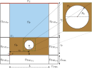
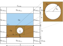
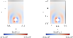

# Benchmark 4
This benchmark aims to demonstrate that the translated formulation is equivalent to the original one, allowing for a significant reduction in the size of the computational domain. In the original formulation, the free surface boundary is required to introduce the incident sonar field into the computational domain. However, if the incident field is assumed to be known, the total field can be decomposed into the sum of the known incident field and the scattered field, $\boldsymbol{u} = \boldsymbol{u}^i + \boldsymbol{u}^s$ having to compute only the scattered one. The scattering object used in this benchmark consists in a rigid circle. On one hand, the computational domain of the original formulation is shown in the following figure:

<p align="center">
  
</p>

whose mathematical formulation holds:

$$
\left\\{
\begin{array}{l}
-\omega^2 \rho(\omega)J \boldsymbol{U} - K(\omega)\mathrm{div}\left(JH^{-T}\left(H^{-1}:\nabla\boldsymbol{U}\right)\right) = \boldsymbol{0} \qquad  &\text{in } \Omega_{\mathrm{F}} \cup \Omega_{\mathrm{P}}\cup \Omega_{\mathrm{PML}},\\ 
-\rho_{\mathrm{F}} c_{\mathrm{F}}^2 \mathrm{div} \boldsymbol{U} = P_0 \qquad  &\text{on } \Gamma_\mathrm{T}, \\
\rho_{\mathrm{F}} c_{\mathrm{F}}^2 \mathrm{div}\boldsymbol{U}\_{\mathrm{F}} = K_{\mathrm{P}}(\omega)\mathrm{div}\boldsymbol{U}\_{\mathrm{P}}  \qquad  &\text{on } \Gamma_\mathrm{I}, \\
 \boldsymbol{U}\_{\mathrm{F}} \cdot \boldsymbol{n} = \boldsymbol{U}\_{\mathrm{P}} \cdot \boldsymbol{n} \qquad  &\text{on } \Gamma_\mathrm{I}, \\
 \boldsymbol{U}\_{\mathrm{P}} \cdot \boldsymbol{n} = 0 \qquad  &\text{on } \Gamma_\mathrm{S}, \\
 \boldsymbol{U}\cdot \boldsymbol{n} = 0 \qquad  &\text{on } \Gamma_\mathrm{PML}.
\end{array}
\right. 
$$

On the other hand, the computational domain of the translated formulation is shown in the following figure:

<p align="center">
  
</p>

whose mathematical formulation holds:

$$
\left\\{
\begin{array}{l}
-\omega^2 \rho(\omega)J \boldsymbol{U}^s - K(\omega)\mathrm{div}\left(JH^{-T}\left(H^{-1}:\nabla\boldsymbol{U}^s\right)\right) = \boldsymbol{0} \qquad  &\text{in } \Omega_{\mathrm{F}} \cup \Omega_{\mathrm{P}}\cup \Omega_{\mathrm{PML}},\\ 
\rho_{\mathrm{F}} c_{\mathrm{F}}^2 \mathrm{div}\boldsymbol{U}\_{\mathrm{F}}^s = K_{\mathrm{P}}(\omega)\mathrm{div}\boldsymbol{U}\_{\mathrm{P}}^s  \qquad  &\text{on } \Gamma_\mathrm{I}, \\
 \boldsymbol{U}\_{\mathrm{F}}^s \cdot \boldsymbol{n} = \boldsymbol{U}\_{\mathrm{P}}^s \cdot \boldsymbol{n} \qquad  &\text{on } \Gamma_\mathrm{I}, \\
 \boldsymbol{U}\_{\mathrm{P}}^s \cdot \boldsymbol{n} = \boldsymbol{U}\_{\mathrm{P}}^i \cdot \boldsymbol{n} \qquad  &\text{on } \Gamma_\mathrm{S}, \\
 \boldsymbol{U}^s\cdot \boldsymbol{n} = 0 \qquad  &\text{on } \Gamma_\mathrm{PML}.
\end{array}
\right. 
$$

The results obtained, among other things, compare the solution obtained by the solver using the original formulation with the translated one, showing that both are equivalent:

<p align="center">
  
</p>

## Requirements and Setup
### Prerequisites
Have a stable version of Julia. All this code has been run on a personal LAPTOP.

### Installation

```bash
git clone https://github.com/pablorubial/SeabedFEM.git
cd benchmark4
julia
```
```julia
using Pkg
Pkg.activate(".")
Pkg.instantiate()
```
### Usage

The benchmark is fully parameterised, so use the `Configuration.jl` file to introduce the desire parameters shown in the previous figures.

The `Run.jl` file runs the benchmark using a conventional approach.

The `RunTranslated.jl` file run the benchmark applying a translation technique.

The `AllRunCompare.jl` file makes a comparison between the results obtained with the two techniques taking the JLD2 files a compute the relative $L^2$ errror betweeen the original formulation and rhe tranlated one taking as reference solution the original one.

### How to run
```julia
include("src/AllRunCompare.jl")
```

### Authors
This work has been carried out by Andres Prieto Aneiros (andres.prieto@udc.es) and Pablo Rubial Yáñez (p.rubialy@udc.es) during the work developed in the [NumSeaHy](https://dm.udc.es/m2nica/en/node/157) project.

### License
 <p xmlns:cc="http://creativecommons.org/ns#" >This work is licensed under <a href="http://creativecommons.org/licenses/by/4.0/?ref=chooser-v1" target="_blank" rel="license noopener noreferrer" style="display:inline-block;">CC BY 4.0</a></p> 
