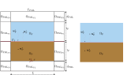
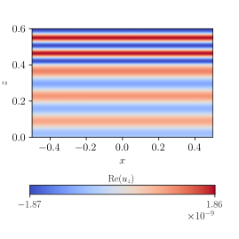

# Benchmark 6

This benchmark aims to demonstrate that the new technique developed to compute analitically the incident field (reflected in the fluid and transmitted in the porous) using Fourier modes produces the same results as the ones obtained using the translation of the solution technique, where the total field is splitted in a known fluid incident field and a unknown scattering one $\boldsymbol{u} = \boldsymbol{u}^i + \boldsymbol{u}^s$. The computational domain used to solve the two peoblems is shown in the next figure, where the left figure consist to the domain using in the tranlated approach (where a PML has to be used to bound the domain) and the right figure consists in the domain used to compute the solution using Fourier modes, where the nature of the solution computed directly the reflected and transmitted fields.


<p align="center">
  
</p>

The mathematical equations for the translated problem is:

$$
\left\\{
\begin{array}{l}
-\omega^2 \rho\_\mathrm{F}(\omega)J \boldsymbol{U}^s - \rho\_\mathrm{F}c\_\mathrm{F}^2(\omega)\mathrm{div}\left(JH^{-T}\left(H^{-1}:\nabla\boldsymbol{U}^s\right)\right) = \boldsymbol{0} \qquad  &\text{in } \Omega_{\mathrm{F}} \cup \Omega_{\mathrm{PML}},\\ 
-\omega^2 \rho\_\mathrm{P}(\omega)J \boldsymbol{U}^s - K\_\mathrm{P}(\omega)\mathrm{div}\left(JH^{-T}\left(H^{-1}:\nabla\boldsymbol{U}^s\right)\right) = \boldsymbol{f} \qquad  &\text{in } \cup \Omega_{\mathrm{P}}\cup \Omega_{\mathrm{PML}},\\ 
\rho_{\mathrm{F}} c_{\mathrm{F}}^2 \mathrm{div}\boldsymbol{U}\_{\mathrm{F}}^s = K_{\mathrm{P}}(\omega)\mathrm{div}\boldsymbol{U}\_{\mathrm{P}}^s + g  \qquad  &\text{on } \Gamma_\mathrm{I}, \\
 \boldsymbol{U}\_{\mathrm{F}}^s \cdot \boldsymbol{n} = \boldsymbol{U}\_{\mathrm{P}}^s \cdot \boldsymbol{n} \qquad  &\text{on } \Gamma_\mathrm{I}, \\
 \boldsymbol{U}^s\cdot \boldsymbol{n} = 0 \qquad  &\text{on } \Gamma_\mathrm{PML}.
\end{array}
\right. 
$$

where $\boldsymbol{f} = \left(\omega^2\rho\_\mathrm{P}(\omega)-k\_\mathrm{F}K\_\mathrm{P}\right)\boldsymbol{U}\_\mathrm{F}^i$ and $g= \left(1-\frac{K\_\mathrm{P}}{\rho\_\mathrm{F}c\_\mathrm{F}^2}\right)$ are the resulting terms for apply the translation of the solution technique. The variational formulation of this problem can be written as follows:

$$
\begin{split}
    \underbrace{\omega^2\int_{\Omega_{\mathrm{F}} \cup \Omega_{\mathrm{P}} \cup\Omega_{\mathrm{PML}}}{\rho(\omega) J^{-1}\left(H\boldsymbol{U}\right)\cdot\left(H\boldsymbol{v}\right) \mathrm{d}\Omega}}\_{\text{mass term}} -
    \underbrace{\int_{\Omega_{\mathrm{F}} \cup \Omega_{\mathrm{P}}\cup \Omega_{\mathrm{PML}}}{KJ^{-1}\mathrm{div}\boldsymbol{U}\mathrm{div}\boldsymbol{v} \mathrm{d}\Omega}}\_{\text{stiffness term}} = \\
    \underbrace{\int_{\Omega_{\mathrm{P}}}{\boldsymbol{f}\cdot\boldsymbol{v}\ \mathrm{d}\Omega_\mathrm{P}}}\_{\text{volumetric source term}} +   \underbrace{\int_{\Gamma{\mathrm{I}}}{g(\boldsymbol{v}\cdot\boldsymbol{n})\ \mathrm{d}\Gamma\mathrm{I}}}\_{\text{boundary source term}}  \qquad  \forall{\boldsymbol{v}}\in V,
\end{split}
$$

The results obtained, among other things, compare the solution obtained by the solver using the original formulation with the translated one, showing that both are equivalent:

<p align="center">
  
  
</p>


## Requirements and Setup
### Prerequisites
Have a stable version of Julia. All this code has been run on a personal LAPTOP.

### Installation

```bash
git clone https://github.com/pablorubial/SeabedFEM.git
cd benchmark6
julia
```
```julia
using Pkg
Pkg.activate(".")
Pkg.instantiate()
```
### Usage

The benchmark is fully parameterised, so use the `Configuration.jl` file to introduce the desire parameters shown in the previous figures.

The `RunFourier.jl` file runs the benchmark using a Fourier modes approach.

The `RunTranslated.jl` file run the benchmark applying a translation technique using the finite element method.

The `AllRunCompare.jl` file makes a comparison between the results obtained with the two techniques taking the JLD2 files a compute the relative $L^2$ errror betweeen the Fourier formulation and the translated one taking as reference solution the Fourier one.

### How to run
```julia
include("src/AllRunCompare.jl")
```

### Authors
This work has been carried out by Andres Prieto Aneiros (andres.prieto@udc.es) and Pablo Rubial Yáñez (p.rubialy@udc.es) during the work developed in the [NumSeaHy](https://dm.udc.es/m2nica/en/node/157) project.

### License
 <p xmlns:cc="http://creativecommons.org/ns#" >This work is licensed under <a href="http://creativecommons.org/licenses/by/4.0/?ref=chooser-v1" target="_blank" rel="license noopener noreferrer" style="display:inline-block;">CC BY 4.0</a></p> 